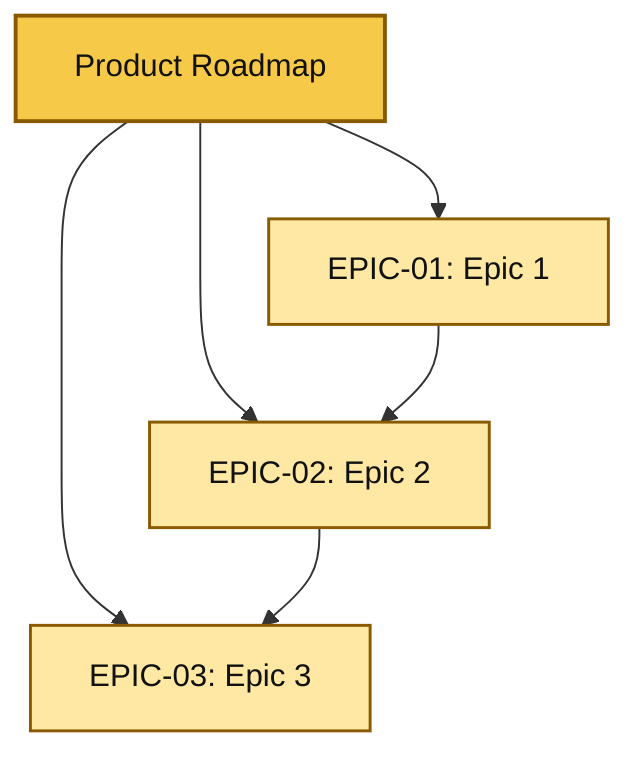

# Create Product Roadmap

## When to Use
- Creating a roadmap after the PRD structure and goals are approved
- Defining epics and release sequencing before user stories are created
- Visualizing the hierarchy from product roadmap to epics
- The user asks to create, generate, or refine a roadmap

## Procedure

### Step 1: Gather Context
1. Read the PRD or product brief
2. Confirm the product goals, scope boundaries, and KPIs are understood
3. Identify the major outcomes that should become epics
4. Confirm whether the roadmap should be embedded in the PRD or created as `product-roadmap.md`

Do NOT create a roadmap without enough context to define meaningful epics.

### Step 2: Define the Roadmap and Epics
Translate the product scope into a small set of epics with clear sequencing and dependencies.

Use the following artifact template:

````markdown
# Product Roadmap: {Product Name}

## Roadmap Overview
- Product: {Product Name}
- Version: {Version}
- Horizon: {Q1-Q4 / Release-based / Phase-based}
- Owner: {Owner}
- Source PRD: {Link or reference}

## Mermaid Roadmap


## Epic Summary
| Epic ID | Epic Name | Objective | Dependencies | Target Phase/Release |
|---------|-----------|-----------|--------------|----------------------|
| EPIC-01 | {Epic} | {Outcome} | {Dependencies} | {Phase} |

## Sequencing Notes
| Phase/Release | Included Epics | Rationale |
|---------------|----------------|-----------|
| Phase 1 | EPIC-01 | {Why first} |

## Risks and Constraints
| Item | Impact | Mitigation |
|------|--------|------------|
| {Risk} | {Impact} | {Mitigation} |
````

### Step 3: Validate with User
Review with the user:
1. Are the epics complete and distinct?
2. Does the sequencing reflect real dependencies?
3. Is the Mermaid roadmap visually clear and useful?
4. Does the roadmap align with the PRD goals and scope?

### Step 4: Place the Artifact
Based on the user's preference:
- **Embedded**: Add the roadmap and epic summary to the PRD roadmap and epics sections
- **Separate file**: Create `product-roadmap.md` and link it from the PRD roadmap section

## Key Rules
- The roadmap artifact MUST use Mermaid
- The roadmap MUST define epics clearly before user stories are created
- Epics MUST include sequencing and dependency information
- Do NOT define user stories in this skill
- The roadmap MUST align with PRD goals, non-goals, and KPIs