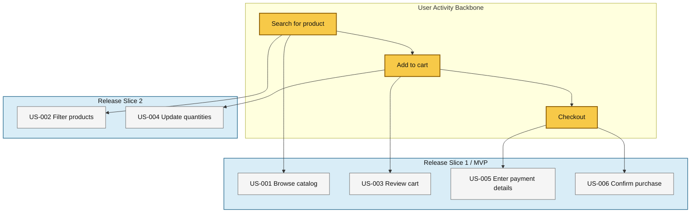

# Create User Story Map

## When to Use
- Creating a user story map after the roadmap and epics are approved
- Organizing user stories into a two-dimensional visual map
- Planning MVP and later release slices before detailed ticket breakdown
- The user asks to create, generate, or refine a user story map

## Concept
User Story Mapping is a technique created by Jeff Patton that organizes user stories into a two-dimensional visual map to preserve context and support release prioritization.

The map works across two axes:
- **Horizontal axis (backbone)**: the chronological user activity flow, showing the major actions a user performs
- **Vertical axis**: the stories beneath each activity, ordered by priority from top to bottom
- **Release lines or slices**: horizontal grouping that indicates which stories belong to the MVP or later releases

This is useful because it avoids a flat backlog, makes the end-to-end journey visible, highlights dependencies and gaps, and aligns stakeholders around a shared narrative.

## Procedure

### Step 1: Gather Context
1. Read the PRD, roadmap, and approved epics
2. Identify the user journey backbone in chronological order
3. Group candidate stories under each user activity
4. Identify MVP and later release slices
5. Confirm whether the map should be embedded in the PRD or created as `user-story-map.md`

Do NOT create a user story map before the roadmap and epics are approved.

### Step 2: Generate the Story Map
Use a visually structured Mermaid flowchart that represents the backbone left-to-right and priorities top-to-bottom under each activity. Represent release slices explicitly so the MVP boundary is visible.

Use the following artifact template:

````markdown
# User Story Map: {Product Name}

## Story Map Overview
- Product: {Product Name}
- Scope: {Release / Epic subset}
- Owner: {Owner}
- Related Roadmap: {Link or reference}

## Mermaid Story Map


## Mapping Table
| Activity | Epic ID | User Story IDs | Release Slice | Dependencies | Notes |
|----------|---------|----------------|---------------|--------------|-------|
| Search for product | EPIC-01 | US-001, US-002 | MVP / Slice 2 | {Dependencies} | {Notes} |

## Slice Definition
| Slice | Goal | Included Stories | Validation Notes |
|-------|------|------------------|------------------|
| MVP | {Goal} | US-001, US-003, US-005, US-006 | {Why this is the minimum viable release} |
````

### Step 3: Validate with User
Review with the user:
1. Does the backbone reflect the real user journey in chronological order?
2. Are the stories grouped under the right user activities?
3. Are the top stories truly the highest priority under each activity?
4. Is the MVP or release slicing realistic and aligned with the roadmap?
5. Does the Mermaid map make dependencies and gaps visible?

### Step 4: Place the Artifact
Based on the user's preference:
- **Embedded**: Add the map to the PRD user story map section
- **Separate file**: Create `user-story-map.md` and link it from the PRD

## Key Rules
- This skill MUST be used before detailed user stories are generated
- The story map MUST use Mermaid
- The backbone MUST represent the user's chronological activity flow
- Stories under each activity MUST be ordered by priority from top to bottom
- The map MUST make release slices explicit so MVP scope is visible
- Do NOT estimate tickets or create implementation tasks in this skill