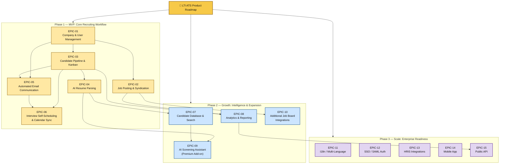

# Product Roadmap: LTI ATS

## Roadmap Overview

- **Product**: LTI ATS (Applicant Tracking System)
- **Version**: 1.0
- **Horizon**: Phase-based (3 phases)
- **Owner**: Cristhian Guerrero
- **Source PRD**: [PRD-LTI-CFGP.md](./PRD-LTI-CFGP.md)

---

## Mermaid Roadmap



---

## Epic Summary

| Epic ID | Epic Name | Objective | Dependencies | Target Phase |
|---------|-----------|-----------|--------------|--------------|
| EPIC-01 | Company & User Management | Companies can sign up, configure accounts, and manage team members with role-based access (admin, recruiter, hiring_manager) | None | Phase 1 |
| EPIC-02 | Job Posting & Syndication | HR Admins create job listings and distribute them to Indeed, LinkedIn, and a branded career page in one click | EPIC-01 | Phase 1 |
| EPIC-03 | Candidate Pipeline & Kanban Board | Recruiters and Hiring Managers track all applicants through a shared visual pipeline with drag-and-drop stage management | EPIC-01 | Phase 1 |
| EPIC-04 | AI Resume Parsing | Inbound applications are automatically parsed to extract structured candidate data (name, email, work history, skills), eliminating manual data entry | EPIC-03 | Phase 1 |
| EPIC-05 | Automated Email Communication | Candidates receive timely, template-driven emails at every pipeline stage transition without recruiter intervention | EPIC-01, EPIC-03 | Phase 1 |
| EPIC-06 | Interview Self-Scheduling & Calendar Sync | Candidates self-schedule interviews by selecting available slots synced with interviewers' Google Calendar or Outlook | EPIC-03, EPIC-05 | Phase 1 |
| EPIC-07 | Candidate Database & Search | Recruiters can search and re-engage past applicants for new openings using keyword search across parsed resume fields | EPIC-04 | Phase 2 |
| EPIC-08 | Analytics & Reporting (Basic) | Hiring teams gain visibility into pipeline metrics: time-to-hire, stage conversion rates, source effectiveness | EPIC-02, EPIC-03 | Phase 2 |
| EPIC-09 | AI Screening Assistant | AI evaluates candidate-job fit and surfaces recommended shortlists (premium $99/mo add-on) | EPIC-04, EPIC-07 | Phase 2 |
| EPIC-10 | Additional Job Board Integrations | Expand syndication to Glassdoor and other boards based on customer demand | EPIC-02 | Phase 2 |
| EPIC-11 | i18n / Multi-Language | UI and email templates support multiple languages for international markets | — | Phase 3 |
| EPIC-12 | SSO / SAML Authentication | Enterprise customers can authenticate via their corporate identity provider | — | Phase 3 |
| EPIC-13 | HRIS Integrations | Connect with BambooHR, Gusto, and other HRIS platforms for seamless data flow | — | Phase 3 |
| EPIC-14 | Mobile App | Native iOS and Android application for on-the-go recruiting | — | Phase 3 |
| EPIC-15 | Public API | Scale-tier customers can build custom integrations via a documented REST API | EPIC-08 | Phase 3 |

---

## Sequencing Notes

| Phase | Included Epics | Rationale |
|-------|----------------|-----------|
| **Phase 1 — MVP** | EPIC-01 → EPIC-06 | Delivers the complete end-to-end recruiting workflow: post jobs, receive & parse applications, manage pipeline, communicate with candidates, and schedule interviews. This is the minimum feature set required to validate product-market fit with small companies and achieve the < 30 min time-to-first-post goal. |
| **Phase 2 — Growth** | EPIC-07 → EPIC-10 | Adds intelligence and breadth. Candidate search enables talent re-engagement (increases retention). Analytics provides hiring insights (reduces churn). AI screening unlocks premium revenue ($99/mo add-on). Additional boards expand reach. All dependent on Phase 1 data foundations. |
| **Phase 3 — Scale** | EPIC-11 → EPIC-15 | Enterprise readiness features that open new market segments: internationalization, corporate SSO, HRIS integration, mobile, and a public API. These are deferred because the target MVP segment (5–100 employee US/UK companies) doesn't require them. |

---

## Dependency Chain (Critical Path)

```
EPIC-01 (Company & User Mgmt)
  ├─→ EPIC-02 (Job Posting) ──→ EPIC-10 (More Boards)
  │                          └─→ EPIC-08 (Analytics)
  ├─→ EPIC-03 (Pipeline & Kanban) ──→ EPIC-04 (Resume Parsing) ──→ EPIC-07 (Search) ──→ EPIC-09 (AI Screening)
  │                               └─→ EPIC-08 (Analytics)
  ├─→ EPIC-05 (Email Communication) ──→ EPIC-06 (Self-Scheduling)
  └─→ EPIC-03 + EPIC-05 ──→ EPIC-06 (Self-Scheduling)
```

**Critical path for MVP**: EPIC-01 → EPIC-03 → EPIC-05 → EPIC-06

EPIC-06 (Interview Self-Scheduling) has the most upstream dependencies and is the last piece to complete the MVP. Starting EPIC-01 and EPIC-02 in parallel is feasible, as is parallelizing EPIC-04 alongside EPIC-05 once EPIC-03 is ready.

---

## Risks and Constraints

| Item | Impact | Mitigation |
|------|--------|------------|
| Indeed/LinkedIn API approval delays | Blocks EPIC-02 job syndication feature | Apply for API access immediately; build career page posting first (no external dependency); support manual posting as fallback |
| Google OAuth consent screen verification timeline | Blocks EPIC-06 calendar sync | Submit verification early; provide manual scheduling link as interim alternative |
| NLP parsing service selection | Blocks EPIC-04 accuracy and cost | Evaluate 2–3 providers (e.g., Affinda, Sovren, open-source) in parallel during EPIC-01/03 development |
| Phase 1 scope overrun | Delays MVP launch and PMF validation | Strict scope enforcement against PRD non-goals; use MoSCoW prioritization to cut to Must-haves if timeline pressure arises |
| Team capacity for 6 epics in Phase 1 | Resource bottleneck if team is small | Parallelize EPIC-02 and EPIC-03 (different domains); consider EPIC-04 as a thin integration first, enhanced later |
