# User Story Map: LTI ATS

## Story Map Overview

- **Product**: LTI ATS (Applicant Tracking System)
- **Scope**: Phase 1 (MVP) and Phase 2 (Growth) — 10 epics
- **Owner**: Cristhian Guerrero
- **Related Roadmap**: [product-roadmap.md](./product-roadmap.md)
- **Source PRD**: [PRD-LTI-CFGP.md](./PRD-LTI-CFGP.md)

---

## Mermaid Story Map

```mermaid
flowchart TB
  classDef activity fill:#f7c948,stroke:#8a5a00,color:#111,stroke-width:2px;
  classDef mvp fill:#d4edda,stroke:#155724,color:#111,stroke-width:1px;
  classDef r2 fill:#cce5ff,stroke:#004085,color:#111,stroke-width:1px;
  classDef backbone fill:#fff3cd,stroke:#856404,color:#111,stroke-width:1.5px;

  subgraph Backbone["👤 User Activity Backbone (left → right = chronological journey)"]
    direction LR
    A1["A1\nSign Up &\nSet Up Company"]
    A2["A2\nCreate &\nPublish Job"]
    A3["A3\nReceive &\nReview Applications"]
    A4["A4\nManage\nCandidate Pipeline"]
    A5["A5\nSchedule\nInterviews"]
    A6["A6\nMake Hiring\nDecision"]
    A7["A7\nSearch &\nAnalyze"]

    A1 --> A2 --> A3 --> A4 --> A5 --> A6 --> A7
  end

  %% ── A1: Sign Up & Set Up Company ──
  A1 --> US01["US-001\nSign up & create\ncompany account"]
  A1 --> US02["US-002\nInvite team members\nwith roles"]
  A1 --> US03["US-003\nConfigure company\nprofile & branding"]
  A1 --> US04["US-004\nConnect calendar\n(Google/Outlook)"]
  A1 --> US05["US-005\nCustomize pipeline\nstages"]

  %% ── A2: Create & Publish Job ──
  A2 --> US06["US-006\nCreate job posting\nwith structured fields"]
  A2 --> US07["US-007\nPreview job on\nbranded career page"]
  A2 --> US08["US-008\nPublish & syndicate\nto job boards"]
  A2 --> US09["US-009\nView syndication\nstatus per board"]
  A2 --> US10["US-010\nClose/archive job\nacross all boards"]
  A2 --> US11["US-011\nSyndicate to\nadditional boards"]

  %% ── A3: Receive & Review Applications ──
  A3 --> US12["US-012\nReceive applications\nvia career page & boards"]
  A3 --> US13["US-013\nAuto-parse resume\ndata (AI)"]
  A3 --> US14["US-014\nReview parsed\ncandidate profile"]
  A3 --> US15["US-015\nDetect duplicate\ncandidates"]

  %% ── A4: Manage Candidate Pipeline ──
  A4 --> US16["US-016\nView candidates on\nKanban board"]
  A4 --> US17["US-017\nDrag card to advance\nor reject candidate"]
  A4 --> US18["US-018\nAdd notes & score\nto application"]
  A4 --> US19["US-019\nAuto-send stage\nchange email"]
  A4 --> US20["US-020\nAI-recommended\nshortlist"]

  %% ── A5: Schedule Interviews ──
  A5 --> US21["US-021\nSend interview\ninvitation with\nscheduling link"]
  A5 --> US22["US-022\nCandidate self-selects\navailable time slot"]
  A5 --> US23["US-023\nConfirm booking &\nsync calendar event"]
  A5 --> US24["US-024\nSend 24h reminder\nto candidate"]
  A5 --> US25["US-025\nCandidate reschedules\nor cancels"]

  %% ── A6: Make Hiring Decision ──
  A6 --> US26["US-026\nRecord interview\nfeedback & score"]
  A6 --> US27["US-027\nHiring Manager\napproves or rejects"]
  A6 --> US28["US-028\nExtend offer &\nsend notification"]
  A6 --> US29["US-029\nMark candidate\nas hired"]

  %% ── A7: Search & Analyze ──
  A7 --> US30["US-030\nSearch past\ncandidates by keyword"]
  A7 --> US31["US-031\nView pipeline\nanalytics dashboard"]

  %% ── MVP Slice ──
  subgraph MVP["🟢 Release Slice 1 — MVP (Phase 1)"]
    US01
    US02
    US03
    US04
    US05
    US06
    US07
    US08
    US09
    US10
    US12
    US13
    US14
    US15
    US16
    US17
    US18
    US19
    US21
    US22
    US23
    US24
    US25
    US26
    US27
    US28
    US29
  end

  %% ── Growth Slice ──
  subgraph R2["🔵 Release Slice 2 — Growth (Phase 2)"]
    US11
    US20
    US30
    US31
  end

  class A1,A2,A3,A4,A5,A6,A7 activity;
  class US01,US02,US03,US04,US05,US06,US07,US08,US09,US10,US12,US13,US14,US15,US16,US17,US18,US19,US21,US22,US23,US24,US25,US26,US27,US28,US29 mvp;
  class US11,US20,US30,US31 r2;
```

---

## Mapping Table

| Activity | Epic ID(s) | User Story IDs | Release Slice | Dependencies | Notes |
|----------|-----------|----------------|---------------|--------------|-------|
| **A1 — Sign Up & Set Up Company** | EPIC-01 | US-001, US-002, US-003, US-004, US-005 | MVP | None | Foundation for all other activities; US-004 (calendar connect) needed before scheduling |
| **A2 — Create & Publish Job** | EPIC-02, EPIC-10 | US-006, US-007, US-008, US-009, US-010, US-011 | MVP (US-006–010), Growth (US-011) | EPIC-01 | US-011 (additional boards) deferred to Phase 2 |
| **A3 — Receive & Review Applications** | EPIC-03, EPIC-04 | US-012, US-013, US-014, US-015 | MVP | EPIC-02 (jobs must be published to receive applications) | US-013 (AI parsing) triggers automatically on application arrival |
| **A4 — Manage Candidate Pipeline** | EPIC-03, EPIC-05, EPIC-09 | US-016, US-017, US-018, US-019, US-020 | MVP (US-016–019), Growth (US-020) | EPIC-03, EPIC-05 | US-019 (auto email) requires EPIC-05 templates; US-020 (AI shortlist) is Phase 2 premium |
| **A5 — Schedule Interviews** | EPIC-06 | US-021, US-022, US-023, US-024, US-025 | MVP | EPIC-05 (email templates), EPIC-01 (calendar connected) | Most integration-heavy activity; critical path terminus |
| **A6 — Make Hiring Decision** | EPIC-03 | US-026, US-027, US-028, US-029 | MVP | EPIC-05 (offer/rejection emails) | Completes the recruiting lifecycle |
| **A7 — Search & Analyze** | EPIC-07, EPIC-08 | US-030, US-031 | Growth | EPIC-04 (parsed data for search), EPIC-02/03 (data for analytics) | Both deferred to Phase 2; not required for core workflow |

---

## Slice Definition

| Slice | Goal | Included Stories | Validation Notes |
|-------|------|------------------|------------------|
| **MVP (Phase 1)** | Deliver a complete end-to-end recruiting workflow — from company setup through job posting, application intake, pipeline management, interview scheduling, to hiring decision — for small companies (5–100 employees) | US-001 through US-029 (excluding US-011 and US-020) — **27 stories** | This is the minimum set needed to replace spreadsheet + email workflows entirely. A user can sign up, post jobs to Indeed/LinkedIn, receive and parse applications, manage candidates on a Kanban board, have candidates self-schedule interviews, and make a hire — all in one tool. Maps to PRD Goal G1 (< 30 min time-to-first-post) and G2 (> 70% self-scheduling rate). |
| **Growth (Phase 2)** | Add intelligence and breadth to increase retention, enable premium revenue, and expand job board coverage | US-011, US-020, US-030, US-031 — **4 stories** | These stories enhance the core workflow but are not required for the primary value proposition. US-020 (AI screening) is a revenue driver ($99/mo add-on). US-030/031 (search + analytics) reduce churn by providing ongoing value beyond active hiring cycles. |

---

## Backbone Narrative

The story map follows the chronological journey of an HR Admin / Recruiter at a small company:

1. **Sign Up & Set Up** — The user creates their company account, invites their hiring manager, brands their profile, connects their calendar, and customizes their pipeline stages. This is a one-time setup activity.

2. **Create & Publish Job** — When a position opens, the user creates a structured job listing, previews it on their branded career page, and publishes it to Indeed and LinkedIn in one click. They monitor syndication status and eventually close the job when the role is filled.

3. **Receive & Review Applications** — As candidates apply through the career page and job boards, applications flow into the system. AI resume parsing extracts structured data automatically. The recruiter reviews parsed profiles and the system detects duplicates.

4. **Manage Candidate Pipeline** — The recruiter uses the Kanban board to track every candidate. Dragging a card triggers automated emails. Notes and scores enable collaborative evaluation with the hiring manager.

5. **Schedule Interviews** — When a candidate reaches the Interview stage, the system sends a scheduling link. The candidate self-selects a time slot synced with the interviewer's calendar. Reminders are sent automatically, and rescheduling/cancellation flows are self-service.

6. **Make Hiring Decision** — After interviews, the team records feedback, the hiring manager approves or rejects, and the recruiter extends an offer or sends a rejection — all tracked on the candidate card.

7. **Search & Analyze** (Phase 2) — Over time, the recruiter builds a candidate database they can search for future roles. Analytics dashboards provide insights into pipeline health and hiring efficiency.
